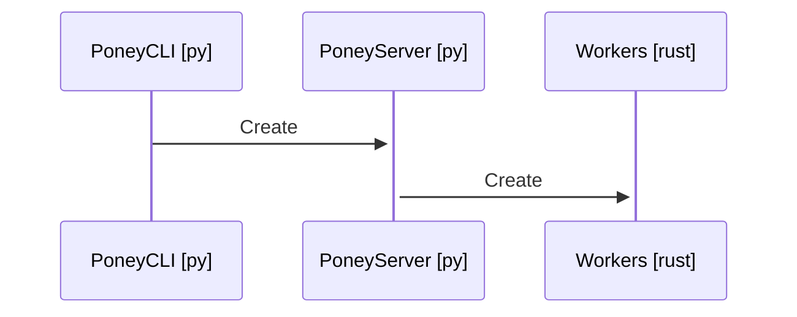

https://stackoverflow.com/questions/68245079/how-can-i-handle-a-socket-response-with-an-external-process-in-rust

```mermaid
sequenceDiagram
    participant cli as PoneyCLI [py]
    participant server as PoneyServer [py]
    participant worker as Workers [rust]

    cli->>+server: Create
    server->>+worker: Create
```